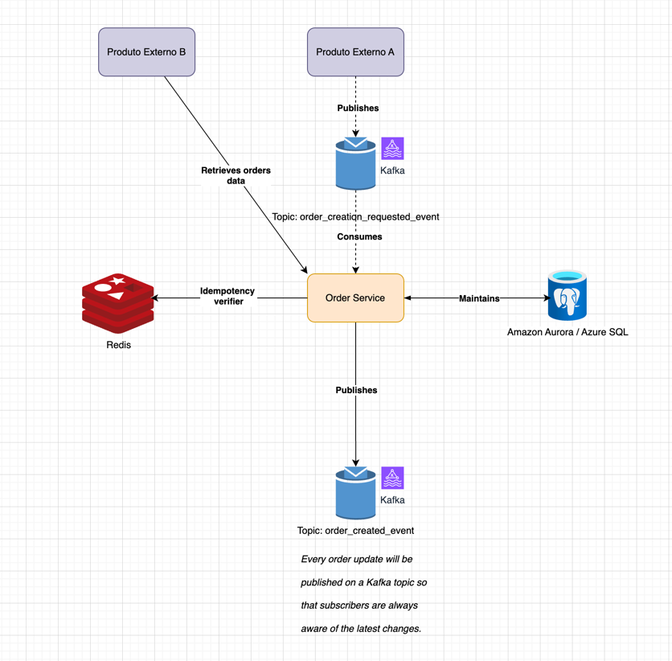

# 🧾 Order Service

This is a sample backend service that demonstrates Clean Architecture with Domain-Driven Design (DDD), Kafka for messaging, Redis for idempotency, and PostgreSQL as the primary datastore. The goal is to showcase a modular, scalable, and testable application architecture using modern Java practices.

## 📚 Table of Contents

- [⚙️ Architecture Overview](#-architecture-overview)
- [📥 Order Creation Flow](#-order-creation-flow)
- [📦 Prerequisites](#-prerequisites)
- [🚀 Getting Started](#-getting-started)
- [🎯 Triggering the Flow](#triggering-the-flow)
- [📊 Access Swagger / Api Documentation](#access-to-api-documentation-http1270018080api--http1270018080swagger-ui)
- [🎛️ Kafka Control Center](#-access-kafka-control-center-dashboard)

## ⚙️ Architecture Overview

This system is designed around an **event-driven architecture**:

- **Kafka** handles asynchronous communication.
- **Redis** is used for idempotency checks.
- **PostgreSQL** is the main persistence layer.
- **Spring Boot** enables modularity and ease of setup.
- **Clean Architecture** separates domain, application, infrastructure, and interfaces.



---

## 📥 Order Creation Flow

1. **External Product A** publishes an event to the Kafka topic:
2. The **Order Service** consumes this event and:
- Verifies **idempotency** using Redis
- Persists the order data into **Postgres**
3. Upon success, the Order Service publishes a new event to: > _Every order update is published to this topic to keep subscribers informed of the latest changes._
4. **External Product B** can retrieve order data by making direct requests to the Order Service.


## 📦 Prerequisites

Before you begin, ensure you have the following installed:

- Java 24 - Take advantage of Virtual Threads
- Apache Gradle
- Docker
- Curl (for testing endpoints)

## 🚀 Getting Started

1. Clone the repository:
```bash
     git clone https://github.com/mateusrfiuza/order.git
      cd orders
```
2. How to execute local tests:
```bash
./gradlew test
```
3. How to start the application:
   - Docker service should be up!
```bash
./gradlew clean build bootRun
```

## 🎯Triggering the flow
  This internal endpoint will trigger an order creation
  ```
    curl -X 'POST' \
      'http://127.0.0.1:8080/orders' \
      -H 'accept: */*' \
      -H 'Content-Type: application/json' \
      -d '{
      "customerId": "c9a1f8ae-1234-4b5c-9d0e-abcdef012345",
      "sellerId":   "d7b2e4f0-6789-4a2b-8cfe-fedcba987654",
      "items": [
        {
          "productId": "f1a2b3c4-5678-90ab-cdef-1234567890ab",
          "quantity": 2,
          "price": 10.00
        },
        {
          "productId": "0f9e8d7c-6543-21ba-fedc-0987654321fe",
          "quantity": 2,
          "price": 15.50
        }
      ]
    }
    '
  ```
#### 📊Access to API documentation: `http://127.0.0.1:8080/api` | `http://127.0.0.1:8080/swagger-ui`


#### 🎛️ Access Kafka Control Center Dashboard:

URL:  `http://127.0.0.1:9021/`
